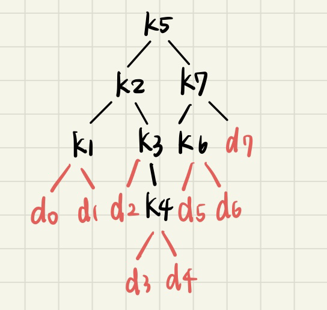
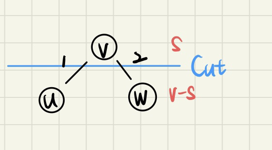

### 14.1-3

#### rod-cutting problem with cut cost

```
BOTTOM-UP-CUT-ROD-WITH-COST(p, n, c)
    let r[0..n] be a new array
    r[0] = 0
    for j = 1 to n
        q = -∞
        for i = 1 to j
            q = max(q, p[i] + r[j - i] - (c if i != j else 0))
        r[j] = q
    return r[n]
```

---

### 14.1-5

```
MEMOIZED-CUT-ROD-WITH-SOLUTION(p, n)
    let r[0..n] be a new array
    let s[0..n] be a new array
    for i = 0 to n
        r[i] = -∞
    return MEMOIZED-CUT-ROD-AUX-WITH-SOLUTION(p, n, r, s)

MEMOIZED-CUT-ROD-AUX-WITH-SOLUTION(p, n, r, s)
    if r[n] ≥ 0
        return r[n], s[n]
    if n == 0
        return 0, []
    q = -∞
    for i = 1 to n
        temp_revenue, temp_cuts = MEMOIZED-CUT-ROD-AUX-WITH-SOLUTION(p, n - i, r, s)
        if p[i] + temp_revenue > q
            q = p[i] + temp_revenue
            s[n] = [i] + temp_cuts
    r[n] = q
    return q, s[n]
```

---

### 14.2-1

#### optimal parenthesization of <5, 10, 3, 12, 5, 50, 6>

| |A|B|C|D|E|F|
|-|:-:|:-:|:-:|:-:|:-:|:-:|
|A|0|150|330|405|1655|2010|
|B||0|360|330|2430|1950|
|C|||0|180|930|1770|
|D||||0|3000|1860|
|E|||||0|1500|

$=> ((AB))(((CD)(EF)))$

---

### 14.2-6

#### Show that a full parenthesization of an $n$-element expression has exactly $n-1$ pairs of parentheses.

We will have $n-1$ ways to break $A_1A_2...A_n$ into 2 pices.  
So $n-1$ pairs of parentheses.  

---

### 14.3-1

1. enumerate all the ways
$
P(n)=
\begin{cases}
1 &,\text{if } n=1 \\
\sum\limits^{n-1}_{i=1}(P(n-i)-P(i)) &,\text{if } n\geq 2
\end{cases}
$
$$
\begin{split} 
P(n) &= 2(P(1)+P(n-1)+P(2)+P(n-2)+\dots+P(n-1)+P(1))+\underline{2(n-1)}_{\text{counting}} \\
     &= 2(P(1)+P(2)+\dots+ P(n-1)) + (2(n-1)) \\
P(n+1)&=2(P(1)+P(2)+\dots+ P(n)) + (2(n))
\end{split}
$$
$P(n+1)-P(n) = 2P(n)+2 \rArr P(n+1)=2+3P(n)$

---

$$
\begin{split}
P(n)+1  &= 3+3P(n-1) = 3(P(n-1)+1) = 9(P(n-2)+1)\\
        &= 3^{n-2}(P(2)+1) = 3^{n-1}
\end{split}
$$
$P(n)=3^{n-1}-1=\Omega(3^{n-1})$

2. recursive time complexity

$T(n)=\begin{cases}C &,\text{if }n=1\\C+\sum\limits_{i=1}^{n-1}\big(T(i)+T(n-i)+C\big) &,\text{if } n\geq 2\end{cases}$

---

$\rArr T(n) \leq Cn+2\sum\limits_{i=1}^{n-1}T(i)$
we assume that$\space T(n) \leq Cn3^{n-1}$
$$
\begin{split}
T(n)&\leq Cn+2\sum\limits_{i=1}^{n-1} Ci3^{i-1}=C\Big(n+2\sum\limits_{i=1}^{n-1} i3^{i-1}\Big)\\
    &=C\Big(n+n3^{n-1}+\frac{1-3^n}{2}\Big)=Cn3^{n-1}+C\Big(n+\frac{1-3^n}{2}\Big)\\
    &\leq Cn3^{n-1}
\end{split}
$$

$2n+1-3^n \leq 0, \forall n \geq 1 \rArr T(n) = O(n3^{n-1})$
so running recursively is faster.

---

### 14.3-4

We assume that there are $A_1, A_2$, and$A_3$  

to find that $P_0P_1P_3 \lt P_0P_2P_3$ and  
$P_0P_1P_2+P_0P_2P_3 \lt P_1P_2P_3+P_0P_1P_3$

Let $P_0, P_1, P_2, P_3=1, 2, 3, 3$ in this case $P_0P_1P_3 \lt P_0P_2P_3$ choosing $A_1(A_2A_3)$ we get  
$A_1(A_2A_3):2\cdot3\cdot3+1\cdot2\cdot3$ ; $(A_1A_2)A_3:2\cdot3\cdot3+1\cdot2\cdot3$  

$(A_1A_2)A_3$ is optimal solution but Caupulet didn't choose it.

---

### 14.4-2

```
FIND-LCS(X, Y, C, i, j)
    if i == 0 or j == 0 return
    if X[i] == Y[j]
        FIND-LCS(X, Y, C, i-1, j-1)
        print(X[i])
    else if C[i-1, j] == C[i, j]
        FIND-LCS(X, Y, C, i-1, j)
    else
        FIND-LCS(X, Y, C, i, j-1)
```

initial call : `FIND-LCS(X, Y, C, m, n)` to print LCS

time complexity $=O(m+n)$

---

### 14.4-5

find the LCS of the array and the sorted copy of that array  

time complexity $= \text{sorting }O(n\text{lg}n) + \text{LCS }O(n^2)=O(n^2)$ 

---

### 14.5-1

```
CONSTRUCT-OBST-SUBTREE(root[], i, j, r, dir)
    if j < i
        print('d', j, ' is the ', dir, ' child of ', 'k', r)
    else
        rt = root[i, j]
        print('k', rt, ' is the ', dir, ' child of ', 'k', r)
        CONSTRUCT-OBST-SUBTREE(root, i, rt-1, rt, 'left')
        CONSTRUCT-OBST-SUBTREE(root, rt+1, j, rt, 'right')

CONSRTUCT-OPTIMAL-BST(rot[], n)
    r = root[1, n]
    print('k', r, ' is the root')
    CONSTRUCT-OBST-SUBTREE(root, 1, r-1, r, 'left')
    CONSTRUCT-OBST-SUBTREE(root, r+1, n, r, 'right')
```

---

### 14.5-2

`root[1, 7] = 5` 


---

### 14-2

```
Let dp[1:n][1:n] and p[1:n][1:n] be new array 
Let n be the length of the word
for i  =  1 to n
    for j  =  1 to n
        dp[i][j] = -1
Find_LPS(i, j, w[])
    if i  =  j return 1
    if i  >  j return 0
    if dp[i][j] != -1 return dp[i][j]
    if w[i] = w[j]
        dp[i][j] = Find_LPS(i+1, j-1, w) + 2
        p[i][j] = ""
    else
        temp1 = Find_LPS (i, j-1, w)
        temp2 = Find_LPS (i+1, j, w)
        if temp1 < temp2
            dp[i][j] = tep
            p[i][j] = "" 
        else
        dp[i][j] = temp2
            p[i][j] = ""
Return_LPS(i, j, P[][], w[])
    if(i > j) return "" 
    if(i = j) return w[i]
    if p[i][j] = "left" return Return_LPS(i, j-1, p, w)
    if p[i][j] = "down" return Return_LPS(i+1, j, p, w)
    if p[i][j] = "" return w[i] + Return_LPS(i+1, j-1, p, w) + w[j]
```

---

### 15.1-2

$S = \{a_1, a_2, \dots , a_n\}$
$S_t = \{S_1, S_2, \dots , S_n\}$ is the optimal set of starting time  
$F_i = \{f_1, f_2, \dots , f_n\}$ is the optimal set of finisish time
$a_i = [S_i, f_i)\quad a_i$ strats at $S_i$ and finish at $f_i$ 

creat a $S' = \{a_1', a_2', \dots , a_n'\}, a_i' = [f_i, S_i)$

$\{a_{i1}, a_{i2}, \dots , a_{ik}\} \sube S \Leftrightarrow \{a_{i1}', a_{i2}', \dots , a_{ik}'\} \sube S'$

*i.e. selecting the first activity to finish is compatable with selecting the last activity.*

---

To porve that it yields an optimal solution, we let $S_{ij}$ be the set of activities that start after $a_i$ and finish before $a_j$. To find the maximum set of $S_{ij}$, let the maximum set be $A_{ij}$, including some activity $a_k$.
$A_{ik} = A_{ij} \cap S_{ik} \text{ and } A_{ki} = A_{ij} \cap S_{kj} \rArr A_{ij} = A_{ik} \sqcup a_k \sqcup A_{kj}$
$S_{ij}$ contains $|A_{ij}| = |A_{ik}|+|A_{kj}|+1$ activities.
$A_{ij}$ includes optimal solutions to $S_{ik} \text{ and } S_{kj}$.
If I could find a set $A'_{kj}$ in $S_{kj}$ where $|A_{kj}'| \gt |A_{kj}|$, then I could use $A'_{kj}$ rather than $A_{kj}$, $A_{ik}$ is similary.
so $|A_{ik}|+|A'_{kj}|+1 \gt |A_{ik}|+|A_{kj}|+1=|A_{ij}|$
$\rArr A_{ij}$ is an optimal solutioin.

---

### 15.1-4

```
Hull_Assign(S[], f[], n)
Let STACK be the DSA of stack and create n Hulls variable
create t[1:2n] and a[1:n]
for i = n ddownto 1
    STACK.push(Hulli)
for i = 1 to n
    t[i] = {s[i], activity = i, type = "start}
    t[n+i] = {f[i], activity = i, type = "finish"}
    sort(t)
    for i = 1 to 2n-1
        if t[i].type == "finish"
            idx = t[i].activity
            STACK.push(a[idx])
        else
            idx = t[i].activity
            a[idx] = STACK.pop()
            
```
---

### 15.2-1

Let there be items $a, b$ where $\frac{V_a}{W_a} \gt \frac{V_b}{W_b}$

Let $n = min(W_a, W_b)$. If we take $n$ weight of $b$, we get $n \times \frac{V_b}{W_b}$

However, if we take $n$ weight of $a$, we get $n \times \frac{V_a}{W_a}$

The total value increase since $n \times \frac{V_a}{W_a} - n \times \frac{V_a}{W_a} \gt 0 \rArr$ it has the greedy-choice property.

---

### 15.2-2

```
Solve-Knapsack(w[], n, W)
    creat dp[0:w] and p[0:w]
    max_val = 0
    for i = 1 to w
        dp[i] = 0
    dp[0] = 1
    for n = 1 to n
        for j = w to W-wi
            if dp[j-wi] = 1
                dp[j] = 1
                p[j] = i
                max-val = max(j,max-val)
Find_Item (p[],w[],n)
    if n = 0 return
        get one item w[n]
        Find_Item (p[],d[],n-d[p[n]])
    
```


---

### 15.3-1

$\text{a.freq} \leq \text{b.freq} \text{ and } \text{x.freq} \leq \text{y.freq}$
$\text{a.freq} = \text{b.freq} \rArr \text{a.freq} \leq \text{b.freq} = \text{x.freq} \leq \text{y.freq}$
Since $x$ and $y$ are two characters having the lowest frequency

we have $\quad\text{b.freq} \leq \text{y.freq} \rArr \text{b.freq} = \text{y.freq}$
and$\quad\quad \space\space\space \text{a.freq} \leq \text{x.freq} \rArr \text{a.freq} = \text{x.freq}$

Thus, the $\text{freq}$ of $a, b, x, y$ are the same.

---

### 15.3-3


$\{a: 00000000, b: 0000001, c: 000001, d: 00001, e: 0001, f: 001, g: 01,  h: 1\}$

the character with frequency $F_i$ will be 
$$
\begin{cases}
i=1: 0\underbrace{\dots}0 \\
\qquad\space\space\quad \scriptsize{n-1} \\
i\geq 1: 0\underbrace{\dots}01\\
\qquad\space\space\quad \scriptsize{n-i} 
\end{cases}
$$


---

### 15.4-1

```
Furthset_In_Future(b[], n, k)
    Let S be a set, i = 1
    while i <= n
        if b[i] in S
            print b[i] "cache hit"
        else
            if |S| < k
                print b[i]
                S = S U b[i]
            else
                break
        i = i + 1
    Let priority[1:n] be the new array
        for j = 1 to n
            priority[j] = 0
        for j = i to n
            priority[b[j]] = n+1-j
    Let Q be a min-priority queue, sort by the second key
        for v in S
            ENQUEUE(Q,{v,priority[v]})
```
---

### Cont.

```
m = i
while i <= n
    if b[i] in S
        print b[i] "cache hit"
    else 
        print b[i] "cache miss"
        if PQ is not empty
            {Z, P} = DEQUEUE(PQ)
            S = (S-{Z}) U b[i]
            if priority [b[i]] = n+1-i
                priority[b[i]] = 0
            ENQUEUE(PQ,{b[i], priority[b[i]]})
        else
            Z = b[m]
            S = (S-{Z}) U b[i]
        m = i
    i = i+1
```
---

### 15.4-3

$x$: evict block x when $b_i$ is requested
$y$: evict block x when $b_j$ is requested
Note that $j = n+1,\dots m>i$
If $C_{s'j} = D_j \sqcup x$
be changed into $C_{s'j} = D_j \sqcup y$,
meaning that when $b_{j-1}$ is requested, the y is evicted. 
However, when $b_j$ is requested, y is evicted again!
y is evicted twice is not true, since the value in cache

---

### 15-1

##### a.

```
Exchange(n)
    nq = floor(n/25)
    n = n mod 25
    nd = floor(n/10)
    n = n mod 10
    nn = floor(n/5)   
    n = n mod 5
    np = n
```

We exchange $n$ cents into the lagest coin and solve the $n-c$ cents subproblem. Whict yields the optimal solution.

---

##### b.
Assume that we exchange $n$ cents. by the algorithm above, we get $\lfloor n \mod c^{i+1}/c^i\rfloor$ of $c^i$ where $i=0\sim k-1$ and get $\lfloor n/c^k\rfloor$ of $C^k$.

##### c. 
If there are only penny, dime and quarter, 30 cents with the greedy algroithm would yield the 1 quarter and 5 pennies. However, we would just use 3 dimes, taking less coins than the algorithm. It doesn't yield optimal solution.

---
##### d.
```
Exchange(d[], n, k)
    create dp[0:n] and p[1:n]
    dp[0] = 0
    for i = 1 to n
        dp[i] = ∞
        for j = 1 to K
            if n >= d[j] and 1+dp[i-d[j]] < dp[i]
                dp[i] = dp[i-d[j]]+1
                p[i] = d[j]
        return dp[n] and p[]
    Find_Coin(p[], d[], n)
        if n = 0 return
            get one d[p[n]] coin
            Find_Coin(p[], d[], n-d[p[n]])
```

---

### 21.1-2


$G = (\{u,v,w\},\{(u,w),(v,w)\})$
both $(u,v)$ and $(v,w)$ are safe edges crossing
$(S,V-S)$. However, $(u,w)$ is not a light edge
for the cut.

---

### 21.1-3

Let $T$ be the MST of $G$
    $\{(u,v)\in T | (u,v)$ is the edge crossing some cut of $(s, v-s)$ and $(u,v)$ is not a light edge$\}$ $\rArr \exist w(x,y)$ such that  $w(x,y) < w(u,v)$

by ***Theorem 21.1***, we could construct spanning tree $T'$, removing $(u,v)$ from $T$ and adding $(x,y) \rArr w(T') = w(T) -w(u,v)+w(x,y) < w(T)$

$\rArr (u,v)$ is a light edge crossing some cut.

---

### 21.2-4

1. The sorting time could be $O(|V| + |E|)$ by counting sort.
Because $|V| = O(|E|) \rArr O(|V|+|E|) = O(|E|)$
$O(|V| + |E|) \alpha(|V|)$ = $O(|E|\alpha|V|)$
Time Complexity : $O(|E|\alpha|V|)$

2.  As above, sorting cost $O(w+|E|)$
The operation of set cost $O(|v|+|E|) \alpha (|V|) =  O(|E|  \alpha|V|)$
    Time Complexity : $O(|E|\alpha|V|)$

---

### 21.2-5


```
for u in G.V
    INSERT(Q, u)
```
the time for priority queue insert |V| elements could be $O(|V| \text{lglg} |V|)$

```
for v in G.adj[u]
    if v in Q and w(u,v) < v.key
        v.pi = u
        v.key = w(u,v)
        DECREASE-KEY(Q, u, w(u,v))
```
$|V|$ is constant $\rArr O(|E|)$
1. $O(|E|+|V|\text{lglg}|V|)$
2. w is constant $\rArr |V|$ is constant $\rArr O(|E|)$

---

### 21-1 and 21.1-6 

##### a.

Assuming $G$ has no two different MST $T$ and $T'$. Let $(u, v) \in T \text{ and} \notin T'$
If we remove$(u,v)$ from $T$ to make $T$ not connected.
$(u,v)$ is a unique light edge for some cut$(s, v-s)$.
Let $(x,y)$ be the edge crossing $(s, v-s)$ and $(x,y) \in T'$.
We have $w(x,y) > w(u,v)$. By ***Thm.21.1***, we could construct  $T'' \text{ s.t. }w(T'') < w(T') \rArr$ $T'$ is not MST (*) so MST is unique.

---

.png)

---

##### b.

Let $T$ be the MST of $G$ , suppose $T'$ is the 2nd-best MST which is different from $T$ by two or more edges.
Let $(u,v)$ be the minimum weight edge in $T - T'$
If we add $(u,v)$ to $T'$ , we could get a cycle $C$. 
This cycle contains some edge $(x,y)$ in $T' - T$

##### claim that $w(x,y) > w(u,v)$

assume w(x,y) < w(u,v), if we add (x,y) to T,
we get a cycle $C'$, which contains some edge $(u',v')$ in $T - T'$.

---

The set $T'' = T - \{(u',v')\} \cup \{x,y\}$
forms a spanning tree, we have $w(u',v') < w(x,y) (*)$
It contradict with $(u,v)$ is the edge with minimum weight in $T - T'$

so we get $w(x,y) > w(u,v)$ , and we could get $T''' = T' - \{(x,y)\} \cup \{(u,v)\}$ which is also a spanning tree. 
It's neither $T'$ nor $T$. $w(T''') < w(T')$ which yields a better solution than $T'$. So $T'$ is not the 2nd-best solution.
i.e. 2nd-best MST and MST will be different with 1 edge.

---

.png)

---

##### c.

```
BFS(G, T, W)
    create max [1:|V|][1:|V|]
    for u in G.V
        for v in G.V
            max[u,v] = w[u,v]
        Let Q be a new empty queue
        ENQUEUE(Q,U)
        while Q is not empty 
            X = DEQUEUE(Q)
            for v in G.adj[x]
                if max[u,v] == NULL and v != u
                    if x == u or w(x,v) > w(max([u,x]))
                        max[u,v] = (x,v)
                    else
                        max[u,v] = max[u,x]
                    ENQUEUE(Q, V)
    return max
```


---

##### d.

1. make MST: $O(|E|+|V|\text{lg}|V|)$.
2. compute max array in (C.): $O(|V|^2)$
3. find an edge $(u,v) \notin T$ that minimize $w[u,v]-w(max[u,v])$: $O(|V|^2)$
4. Get the $T' = T-\{max[u,v]\} \cup \{u,v\}$

time complexity: $O(|V^2|)$
