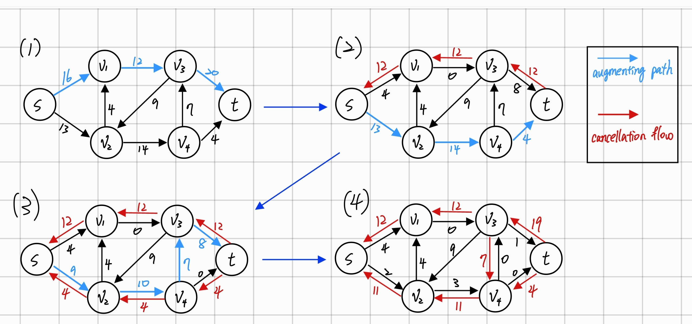

# Algorithm Homework 6

---

## 24.1-1

- The flow conservation property must hold at vertex $x$, which means the incoming flow to $x$ is equal to the outgoing flow from $x$.

- so in the new graph $G'$, the new edges $(u,x)$m $(x,v)$ effectively behave like the original edge $(u,v)$ in terms of capacity and flow.

- Therefore, any feasible flow in $G$ can be transformed into a feasible flow in $G'$ and vice versa, without changing the total amount of flow.

---

## 24.1-2
- Using flow conservation, a flow $f$ in $G$ can be converted to a flow $f'$ in $G$ by setting $f'(s, s_i)=\sum_{v\in V} f(s_i, v)$ and $f'(t_i, t)=\sum_{v\in V} f(v, t_i)$
- The value of the flows in $G'$ is the sum of the flows from the supersource $s$ to the sources $S$, which is the same as the sum of the flows form the sources $S$ to the sinks $T$ in $G$.
- Therefore, the maximum flow in $G$ is equal to the maximum flow in $G'$.

---

## 24.2-3



---

## 24.2-5
- The flows must go through the original graph $G$, which has edges with finite compacities.

- Thus, any flow in the new network has a finite value if the edges of the original network with multiple sources and sinks have finite capacity.

---

## 24.2-8
   
1. **Capacity Constraint**: The capacity constraint is applied to the amount of flow that can pass through an edge, and this remains unchanged.

2. **Termination Condition**: The absence of edges into $s$ means that once flow is sent out from $s$, it cannot be returned, but this doesn't affect the identification of valid paths from $s$ to $t$

3. **Maximum Flow**: The absence of edges into $s$ does not change the capacities of the edges crossing any cut. Thus, the maximum flow calculated is still accurate.

- The algorithm's key properties—flow conservation, capacity constraints, and termination condition—remain valid, ensuring the correct maximum flow is found.

---

## 24.3-3

- By definition, an augmenting path is a simple path $s \rightsquigarrow t$ in the residual network $G'_f$. The only edges involving $s$ or $t$ connect $s$ to $L$ and $R$ to $t$.
- Thus any augmenting path must go
$s \rightarrow L \rightarrow R \rightarrow \cdots \rightarrow L \rightarrow R \rightarrow t$
crossing back and forth between $L$ and $R$ at most as many times as it can do so without using a vertex twice. It contains $s$, $t$, and equal numbers of distinct vertices from $L$ and $R$—at most $2 + 2 \cdot \min(|L|, |R|)$ vertices in all. The length of an augmenting path (i.e., its number of edges) is thus bounded above by $2 \cdot \min(|L|, |R|) + 1$.


---

## Problems 24-1

### Part (a)

We transform the original graph $G$ into a new graph $G'$ that only has edge capacities. The transformation involves splitting each vertex $v$ with a capacity $c(v)$ into two vertices $v_{in}$ and $v_{out}$, and connecting them with an edge of capacity $c(v)$.

1. **Vertex Splitting**:
   - For each vertex $v$ in the original graph $G$:
     - Create two vertices $v_{in}$ and $v_{out}$ in the new graph $G'$.
     - Add an edge from $v_{in}$ to $v_{out}$ with capacity equal to the vertex capacity $c(v)$.

---

2. **Edge Transformation**:
   - For each edge $(u, v)$ in the original graph $G$ with capacity $c(u, v)$:
     - Add an edge from $u_{out}$ to $v_{in}$ in the new graph $G'$ with capacity $c(u, v)$.

This transformation ensures that the flow through each vertex in the original graph $G$ is subject to the vertex capacity constraint, as the flow through the corresponding edge $(v_{in}, v_{out})$ in the new graph $G'$ is limited by the same capacity.

---

### Part (b)

1. **Construct the Flow Network**:
   - Create a super source $s$ and connect it to each of the $m$ starting points $(x_1, y_1), (x_2, y_2), \ldots, (x_m, y_m)$ with edges of infinite capacity.
   - Create a super sink $t$ and connect all boundary vertices (vertices on the edge of the grid) to $t$ with edges of capacity 1.

2. **Vertex Splitting**:
   - Split each vertex $(i, j)$ (except for $s$ and $t$) in the grid into two vertices $(i, j)_{in}$ and $(i, j)_{out}$ with an edge of capacity 1 between them.

---

3. **Edge Construction**:
   - For each vertex $(i, j)$ in the grid, add edges from $(i, j)_{out}$ to the in-vertices of its neighboring vertices (up, down, left, right) with infinite capacity.

4. **Compute Maximum Flow**:
   - Run the Ford-Fulkerson algorithm or any of its implementations (e.g., Edmonds-Karp) to compute the maximum flow from $s$ to $t$ in the constructed flow network.

5. **Check the Solution**:
   - If the maximum flow value is equal to $m$, there exist $m$ vertex-disjoint paths from the starting points to the boundary.
   - Otherwise, such paths do not exist.

---

### Running Time Analysis:
- Constructing the flow network takes $O(n^2)$ time since there are $O(n^2)$ vertices and $O(n^2)$ edges in the grid.
- Splitting vertices and adding edges also takes $O(n^2)$ time.
- The Ford-Fulkerson algorithm with the Edmonds-Karp implementation runs in $O(VE^2)$ time, where $V = O(n^2)$ and $E = O(n^2)$.

Thus, the overall running time is $O(n^2)$

---

## 34.1-1

### Definitions
1. **Optimization Problem: LONGEST-PATH-LENGTH**
   - Given an undirected graph $G = (V, E)$ and two vertices $u$ and $v$, the problem is to find the number of edges in the longest simple path between $u$ and $v$.

2. **Decision Problem: LONGEST-PATH**
   - Given an undirected graph $G = (V, E)$, vertices $u, v \in V$, and an integer $k \geq 0$, determine if there exists a simple path from $u$ to $v$ in $G$ consisting of at least $k$ edges.

---

### Proof

#### If Part
If the decision problem LONGEST-PATH belongs to $P$, then we can solve the optimization problem LONGEST-PATH-LENGTH in polynomial time.

1. **Binary Search Approach**:
   - Use the decision problem LONGEST-PATH as a subroutine.
   - Perform a binary search on the number of edges to find the longest path.

---

**Steps**:
1. Initialize $low = 0$ and $high = |E|$.
2. While $low \leq high$:
   - Set $mid = \left\lfloor \frac{low + high}{2} \right\rfloor$.
   - Use the decision problem LONGEST-PATH to check if there is a path of length $mid$ from $u$ to $v$.
   - If such a path exists, set $low = mid + 1$.
   - Otherwise, set $high = mid - 1$.
3. The longest path length is $high$.

Since binary search runs in $O(\log |E|)$ iterations and each iteration involves solving the decision problem (which is polynomial), the overall time complexity is polynomial.

---

### Only If Part

If the optimization problem LONGEST-PATH-LENGTH can be solved in polynomial time, then the decision problem LONGEST-PATH belongs to $P$.

1. **Reduction**:
   - Use the solution to the optimization problem LONGEST-PATH-LENGTH to solve the decision problem LONGEST-PATH.

**Steps**:
1. Solve the optimization problem LONGEST-PATH-LENGTH to find the longest path length $L$ from $u$ to $v$.
2. Compare $L$ with $k$:
   - If $L \geq k$, return YES.
   - Otherwise, return NO.

---

Since solving the optimization problem takes polynomial time, the decision problem can also be solved in polynomial time using this approach.

### Conclusion
The optimization problem LONGEST-PATH-LENGTH can be solved in polynomial time if and only if the decision problem LONGEST-PATH belongs to $P$.


---

## 34.1-5

### Part 1: Constant Number of Polynomial-Time Subroutine Calls

1. **Polynomial-Time Subroutine**:
   - Let the subroutine $P(x)$ run in polynomial time $O(n^k)$, where $n$ is the size of the input $x$ and $k$ is a constant.

---

2. **Algorithm with Constant Calls**:
   - Suppose the algorithm makes $c$ calls to $P(x)$, where $c$ is a constant.
   - Additionally, the algorithm performs some work that takes $O(n^m)$ time, where $m$ is a constant.

3. **Total Running Time**:
   - The total time for the $c$ calls to the polynomial-time subroutine is $c \cdot O(n^k)$.
   - The additional work takes $O(n^m)$ time.

---

4. **Combining the Times**:
   - The overall running time is $c \cdot O(n^k) + O(n^m)$.
   - Since $c$ is a constant, $c \cdot O(n^k)$ is still $O(n^k)$.

5. **Polynomial Time**:
   - Therefore, the total running time is $O(n^k) + O(n^m) = O(n^{\max(k, m)})$, which is polynomial.

---

#### Part 2: Polynomial Number of Polynomial-Time Subroutine Calls

1. **Polynomial-Time Subroutine**:
   - Let the subroutine $P(x)$ run in polynomial time $O(n^k)$, where $n$ is the size of the input $x$ and $k$ is a constant.

2. **Algorithm with Polynomial Calls**:
   - Suppose the algorithm makes $p(n)$ calls to $P(x)$, where $p(n)$ is a polynomial function of $n$.

3. **Total Running Time**:
   - The total time for the $p(n)$ calls to the polynomial-time subroutine is $p(n) \cdot O(n^k)$.

---

4. **Exponential Time**:
   - If $p(n)$ itself is a polynomial function, say $p(n) = n^m$, then the total running time is $n^m \cdot O(n^k) = O(n^{m+k})$, which is still polynomial.
   - However, if $p(n)$ grows exponentially, such as $p(n) = 2^n$, then the total running time becomes $2^n \cdot O(n^k) = O(2^n \cdot n^k)$, which is exponential.

Therefore, a polynomial number of calls to polynomial-time subroutines can result in an exponential-time algorithm if the number of calls grows exponentially with the input size.

---

## 34.2-1

### Verification Algorithm

1. **Certificate**:
   - The certificate for GRAPH-ISOMORPHISM is a bijection $\pi$ between the vertex sets of $G_1$ and $G_2$.
   - $\pi$ is a permutation of the vertices such that $\pi: V(G_1) \rightarrow V(G_2)$ and it maps each vertex in $G_1$ to a unique vertex in $G_2$.

---

2. **Verification Process**:
   - Given the graphs $G_1 = (V_1, E_1)$ and $G_2 = (V_2, E_2)$, and the certificate $\pi$:
     1. For each edge $(u, v)$ in $E_1$:
        - Check if $(\pi(u), \pi(v)) \in E_2$.
     2. For each edge $(u', v')$ in $E_2$:
        - Check if $(\pi^{-1}(u'), \pi^{-1}(v')) \in E_1$.

---

3. **Polynomial Time**:
   - The verification algorithm involves checking if each edge in $G_1$ maps to an edge in $G_2$ and vice versa.
   - The number of edges to be checked is $|E_1| + |E_2|$, and each check can be performed in constant time.
   - Therefore, the verification algorithm runs in $O(|E_1| + |E_2|)$, which is polynomial in the size of the input graphs.

Since we can verify the isomorphism of two graphs $G_1$ and $G_2$ in polynomial time given the bijection $\pi$, GRAPH-ISOMORPHISM is in NP.


---

## 34.2-3

1. **Algorithm to Detect Hamiltonian Cycle**:
   - Assume we have an algorithm $A(G)$ that runs in polynomial time and returns `true` if the graph $G$ contains a Hamiltonian cycle and `false` otherwise.

2. **Constructing the Hamiltonian Cycle**:
   - Initialize an empty list to store the vertices of the Hamiltonian cycle.
   - Start from an arbitrary vertex $v$ in the graph.
   - Recursively build the cycle by considering each vertex one by one.

---

### Procedure:

1. **Find an Initial Hamiltonian Cycle**:
   - Use the algorithm $A(G)$ to check if $G$ contains a Hamiltonian cycle. If not, return that no such cycle exists.

2. **Construct the Cycle**:
   - Start from an arbitrary vertex $v$ and add it to the cycle list.
   - Remove $v$ from the graph and use the algorithm $A(G - v)$ to find the next vertex in the cycle.
   - Repeat this process, each time removing the selected vertex and using $A$ to find the next vertex in the cycle, until all vertices are added.

---

```javascript
FindHamiltonianCycle(G):
    if not A(G):
        return "No Hamiltonian cycle exists"
    cycle = []
    v = any_vertex(G)  // Start with an arbitrary vertex
    cycle.append(v)
    G.remove(v)

    while len(cycle) < number_of_vertices_in_G:
        for each vertex u in G:
            if A(G - u):
                cycle.append(u)
                G.remove(u)
                break

    // Close the cycle by connecting the last vertex to the first
    cycle.append(cycle[0])

    return cycle
```
---

## 34.2-4

### Closure Under Union

1. **Non-Deterministic Polynomial-Time Turing Machine (NPTM)**:
   - Since $L_1 \in \text{NP}$, there exists an NPTM $M_1$ that decides $L_1$ in polynomial time.
   - Similarly, since $L_2 \in \text{NP}$, there exists an NPTM $M_2$ that decides $L_2$ in polynomial time.

2. **Combined NPTM**:
   - Construct an NPTM $M$ that, on input $x$:
     1. Non-deterministically choose either $M_1$ or $M_2$.
     2. Run the chosen machine on $x$.

---

3. **Acceptance**:
   - $M$ accepts $x$ if either $M_1$ or $M_2$ accepts $x$.

Since $M$ runs in polynomial time, $L_1 \cup L_2 \in \text{NP}$.

### Closure Under Intersection

Let $L_1$ and $L_2$ be languages in NP. We want to show that $L_1 \cap L_2 \in \text{NP}$.

1. **Non-Deterministic Polynomial-Time Turing Machine (NPTM)**:
   - Since $L_1 \in \text{NP}$, there exists an NPTM $M_1$ that decides $L_1$ in polynomial time.
   - Similarly, since $L_2 \in \text{NP}$, there exists an NPTM $M_2$ that decides $L_2$ in polynomial time.

---

2. **Combined NPTM**:
   - Construct an NPTM $M$ that, on input $x$:
     1. Non-deterministically run both $M_1$ and $M_2$ on $x$.

3. **Acceptance**:
   - $M$ accepts $x$ if both $M_1$ and $M_2$ accept $x$.

Since $M$ runs in polynomial time, $L_1 \cap L_2 \in \text{NP}$.

### Closure Under Concatenation

Let $L_1$ and $L_2$ be languages in NP. We want to show that $L_1 \cdot L_2 \in \text{NP}$.

---

1. **Non-Deterministic Polynomial-Time Turing Machine (NPTM)**:
   - Since $L_1 \in \text{NP}$, there exists an NPTM $M_1$ that decides $L_1$ in polynomial time.
   - Similarly, since $L_2 \in \text{NP}$, there exists an NPTM $M_2$ that decides $L_2$ in polynomial time.

2. **Combined NPTM**:
   - Construct an NPTM $M$ that, on input $x$:
     1. Non-deterministically split $x$ into $x = uv$.
     2. Run $M_1$ on $u$ and $M_2$ on $v$.

---

3. **Acceptance**:
   - $M$ accepts $x$ if $M_1$ accepts $u$ and $M_2$ accepts $v$.

Since $M$ runs in polynomial time, $L_1 \cdot L_2 \in \text{NP}$.

### Closure Under Kleene Star

Let $L$ be a language in NP. We want to show that $L^* \in \text{NP}$.

1. **Non-Deterministic Polynomial-Time Turing Machine (NPTM)**:
   - Since $L \in \text{NP}$, there exists an NPTM $M$ that decides $L$ in polynomial time.

2. **Combined NPTM**:
   - Construct an NPTM $M'$ that, on input $x$:
     1. Non-deterministically split $x$ into $x = x_1 x_2 \cdots x_k$
     2. For each $x_i$, run $M$ on $x_i$.

---

3. **Acceptance**:
   - $M'$ accepts $x$ if $M$ accepts each $x_i$.

Since $M'$ runs in polynomial time, $L^* \in \text{NP}$.

### Closure Under Complement

The class NP is not known to be closed under complement. This is equivalent to the open question of whether $\text{NP} = \text{co-NP}$. If NP were closed under complement, it would imply $\text{NP} = \text{co-NP}$, which is a major unsolved question in computer science.

---

## 34.3-2

### Definitions

1. **Polynomial-Time Reduction**:
   - A language $L_1$ is polynomial-time reducible to a language $L_2$ (denoted $L_1 \leq_P L_2$) if there exists a polynomial-time computable function $f$ such that $x \in L_1 \iff f(x) \in L_2, \forall x.$

### Proof

1. $L_1 \leq_P L_2$: There exists a polynomial-time computable function $f_1$ such that $x \in L_1 \iff f_1(x) \in L_2, \forall x.$
2. $L_2 \leq_P L_3$: There exists a polynomial-time computable function $f_2$ such that $y \in L_2 \iff f_2(y) \in L_3, \forall y.$

We need to show that $L_1 \leq_P L_3$.

---

### Construction of the Reduction

1. Define a new function $f$ such that $f(x) = f_2(f_1(x)), \forall x.$
   - Since $f_1$ is a polynomial-time computable function, $f_1(x)$ can be computed in polynomial time.
   - Since $f_2$ is a polynomial-time computable function, $f_2(f_1(x))$ can be computed in polynomial time after $f_1(x)$ is computed.

2. Therefore, $f(x)$ can be computed in polynomial time as it is the composition of two polynomial-time computable functions.

---

### Verification

We need to verify that $f$ satisfies the reduction condition:
1. $x \in L_1 \iff f(x) \in L_3, \forall x$

2. By the definitions of $f_1$ and $f_2$, $x \in L_1 \iff f_1(x) \in L_2 \iff f_2(f_1(x)) \in L_3.$

3. Thus, $x \in L_1 \iff f(x) \in L_3.$

### Conclusion

Since $f$ is polynomial-time computable and satisfies the reduction condition, $L_1 \leq_P L_3$. Therefore, the $\leq_P$ relation is transitive.


---

## 34.3-6

### Part 1: $\emptyset$ and $\{0, 1\}^*$ Are Not Complete for $P$

1. **Language $\emptyset$**:
   - $\forall L' \in P$, $L' \leq_P \emptyset$ is not true unless $L' = \emptyset$. 
   - There is no polynomial-time computable function $f$ that can reduce a non-empty language to $\emptyset$.

2. **Language $\{0, 1\}^*$**:
   - $\forall L' \in P$, $L' \leq_P \{0, 1\}^*$ is not true unless $L' = \{0, 1\}^*$.
   - The language $\{0, 1\}^*$ accepts all strings, so there is no meaningful reduction from a specific polynomial-time language to the universal language $\{0, 1\}^*$.

---

### Part 2: Any Other Language in $P$ Is Complete for $P$

1. **Non-Trivial Language**:
   - Consider a non-trivial language $L \in P$ such that $L \neq \emptyset$ and $L \neq \{0, 1\}^*$.
   - For every language $L' \in P$, we need to show that $L' \leq_P L$.

---

2. **Reduction**:
   - Since both $L$ and $L'$ are in $P$, there exist polynomial-time algorithms to decide them.
   - We can construct a polynomial-time reduction from $L'$ to $L$ by mapping each input of $L'$ to an input of $L$ using a polynomial-time computable function.

### Conclusion

The languages $\emptyset$ and $\{0, 1\}^*$ are the only languages in $P$ that are not complete for $P$ with respect to polynomial-time reductions because any non-trivial language in $P$ can be used to polynomial-time reduce any other language in $P$.

---

## 34.4-1

### Exponential Growth Example

Consider a binary tree structure circuit, where each internal node represents a logical AND gate and the leaves represent input variables. Let's denote the size of the circuit by $n$, which corresponds to the number of gates and input variables.

1. **Circuit Description**:
   - The circuit is a full binary tree of depth $d$.
   - The number of leaves (input variables) is $2^d$.
   - The number of internal nodes (AND gates) is $2^d - 1$.
   - Therefore, the total size of the circuit $n$ is approximately $2 \cdot 2^d$, which is $O(2^d)$.

---

2. **Conversion to Formula**:
   - To convert this circuit to a formula, start from the root and recursively replace each AND gate with its corresponding formula.
   - Each AND gate at depth $k$ combines two subtrees, each of which is a formula.

### Exponential Growth in Formula Size

- At the root level, the formula is a conjunction of two subformulas.
- Each of these subformulas is a conjunction of two more subformulas, and so on.

---

#### Size Analysis

1. **Depth of the Tree**:
   - The depth $d$ of the tree is $\log_2(n)$.

2. **Formula Size**:
   - The size of the formula at the root level is the sum of the sizes of its two child subformulas plus the size of the AND operation.
   - Each AND operation at depth $k$ contributes to a formula that is a conjunction of two subformulas of depth $k-1$.

---

3. **Exponential Growth**:
   - At each level, the formula size doubles.
   - For a tree of depth $d$, the formula size is $O(2^d)$.
   - Since $d = \log_2(n)$, the formula size is $O(2^{\log_2(n)}) = O(n)$.

Therefore, a circuit of size $n$ can result in a formula of size $O(2^n)$ when converted using the method described, leading to exponential growth in the size of the formula.

### Conclusion

The circuit that results in exponential growth when converted to a formula is a full binary tree with AND gates at each internal node. This structure ensures that the formula size grows exponentially with the size of the circuit.

---

#### 34.4-3
- Relationship between NP and co-NP: NP and co-NP are related to the ease of verifying "yes" and "no" answers, respectively. It is an open question whether $NP = co-NP$.

---

#### 34.4-5
- Significance of NP-complete problems: If a polynomial-time algorithm exists for any NP-complete problem, then all problems in NP can be solved in polynomial time ($P = NP$).

---

#### 34.5-1
- Polynomial-time reduction: Transforming instances of one problem into instances of another in polynomial time such that the solution to the transformed instance corresponds to the solution to the original instance.

---

#### 34.5-2
- Significance of the first NP-complete problem: Established the concept of NP-completeness and provided a foundation for proving other problems NP-complete by polynomial-time reductions.

---

#### 34.5-4
- Relationship between NP-complete problems and polynomial-time algorithms: If a polynomial-time algorithm exists for any NP-complete problem, then polynomial-time algorithms exist for all problems in NP ($P = NP$).

---

#### 34.5-6
- NP-completeness proofs: Show that a problem is in NP and that every problem in NP can be reduced to it in polynomial time (polynomial-time reduction).

---

### Problems 34-3
- Prove that the problem of finding a Hamiltonian cycle in a graph is NP-complete by showing it is in NP and reducing a known NP-complete problem to it in polynomial time.

