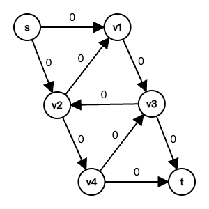

# Algorithm Homework 6

---

## 24.1-1

- The flow conservation property must hold at vertex $x$, which means the incoming flow to $x$ is equal to the outgoing flow from $x$.

- so in the new graph $G'$, the new edges $(u,x)$m $(x,v)$ effectively behave like the original edge $(u,v)$ in terms of capacity and flow.

- Therefore, any feasible flow in $G$ can be transformed into a feasible flow in $G'$ and vice versa, without changing the total amount of flow.

---

#### 24.1-2
- Using flow conservation, a flow $f$ in $G$ can be converted to a flow $f'$ in $G$ by setting $f'(s, s_i)=\sum_{v\in V} f(s_i, v)$ and $f'(t_i, t)=\sum_{v\in V} f(v, t_i)$
- The value of the flows in $G'$ is the sum of the flows from the supersource $s$ to the sources $S$, which is the same as the sum of the flows form the sources $S$ to the sinks $T$ in $G$.
- Therefore, the maximum flow in $G$ is equal to the maximum flow in $G'$.

---

#### 24.2-3

---

#### 24.2-5
- The flows must go through the original graph $G$, which has edges with finite compacities.

- Thus, any flow in the new network has a finite value if the edges of the original network with multiple sources and sinks have finite capacity.

---

#### 24.2-8
   
1. **Capacity Constraint**: The capacity constraint is applied to the amount of flow that can pass through an edge, and this remains unchanged.

2. **Termination Condition**: The absence of edges into $s$ means that once flow is sent out from $s$, it cannot be returned, but this doesn't affect the identification of valid paths from $s$ to $t$

3. **Maximum Flow**: The absence of edges into $s$ does not change the capacities of the edges crossing any cut. Thus, the maximum flow calculated is still accurate.

- The algorithm's key properties—flow conservation, capacity constraints, and termination condition—remain valid, ensuring the correct maximum flow is found.

---

#### 24.3-3
By definition, an augmenting path is a simple path $s \rightsquigarrow t$ in the residual network $G'_f$. The only edges involving $s$ or $t$ connect $s$ to $L$ and $R$ to $t$.
Thus any augmenting path must go
$s \rightarrow L \rightarrow R \rightarrow \cdots \rightarrow L \rightarrow R \rightarrow t$
crossing back and forth between $L$ and $R$ at most as many times as it can do so without using a vertex twice. It contains $s$, $t$, and equal numbers of distinct vertices from $L$ and $R$—at most $2 + 2 \cdot \min(|L|, |R|)$ vertices in all. The length of an augmenting path (i.e., its number of edges) is thus bounded above by $2 \cdot \min(|L|, |R|) + 1$.

---

### Problems 24-1
- Prove that in any flow network, the value of the maximum flow is equal to the capacity of the minimum cut using the max-flow min-cut theorem.

---

### Exercises from Chapter 34 (NP-Completeness)

#### 34.1-1
- Class NP: Decision problems for which a given solution can be verified as correct or incorrect in polynomial time by a deterministic Turing machine.

---

#### 34.1-5
- NP-hard: A problem is NP-hard if every problem in NP can be reduced to it in polynomial time.

---

#### 34.2-1
- Cook-Levin theorem: Boolean satisfiability problem (SAT) is NP-complete.

---

#### 34.2-3
- Polynomial-time reduction: Transforming one problem into another in polynomial time.

---

#### 34.2-4
- Significance of NP-complete: It is both in NP and NP-hard. If any NP-complete problem can be solved in polynomial time, then all problems in NP can be solved in polynomial time ($P = NP$).

---

#### 34.3-2
- Polynomial-time verifier: An algorithm that, given an input $x$ and a certificate $y$, can verify in polynomial time whether $x$ belongs to a language $L$. $L$ is in NP if it has a polynomial-time verifier.

---

#### 34.3-6
- Significance of P vs. NP problem: Asks whether every problem whose solution can be verified in polynomial time can also be solved in polynomial time.

---

#### 34.4-1
- Class co-NP: Decision problems for which a given "no" answer can be verified as correct in polynomial time by a deterministic Turing machine.

---

#### 34.4-3
- Relationship between NP and co-NP: NP and co-NP are related to the ease of verifying "yes" and "no" answers, respectively. It is an open question whether $NP = co-NP$.

---

#### 34.4-5
- Significance of NP-complete problems: If a polynomial-time algorithm exists for any NP-complete problem, then all problems in NP can be solved in polynomial time ($P = NP$).

---

#### 34.5-1
- Polynomial-time reduction: Transforming instances of one problem into instances of another in polynomial time such that the solution to the transformed instance corresponds to the solution to the original instance.

---

#### 34.5-2
- Significance of the first NP-complete problem: Established the concept of NP-completeness and provided a foundation for proving other problems NP-complete by polynomial-time reductions.

---

#### 34.5-4
- Relationship between NP-complete problems and polynomial-time algorithms: If a polynomial-time algorithm exists for any NP-complete problem, then polynomial-time algorithms exist for all problems in NP ($P = NP$).

---

#### 34.5-6
- NP-completeness proofs: Show that a problem is in NP and that every problem in NP can be reduced to it in polynomial time (polynomial-time reduction).

---

### Problems 34-3
- Prove that the problem of finding a Hamiltonian cycle in a graph is NP-complete by showing it is in NP and reducing a known NP-complete problem to it in polynomial time.

