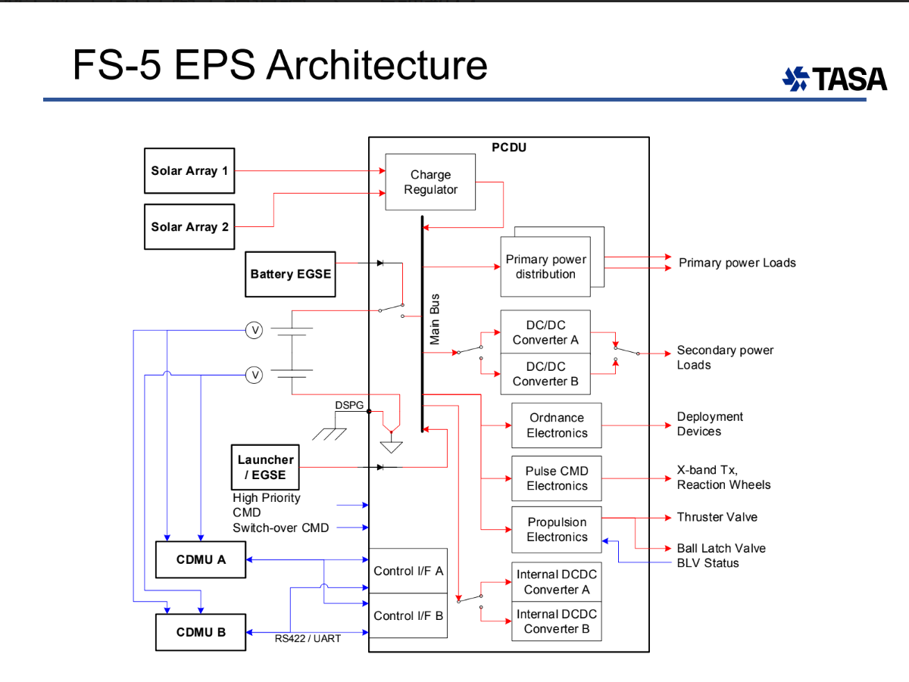

# 福衛五號的電力系統（EPS）架構

福衛五號的電力系統（EPS）設計是為了確保衛星在各種環境條件下能穩定運行。以下是其主要的構成：

---
## EPS 架構
1. **電力來源**：
   - **太陽能電池陣列**：利用太陽能作為主要電力來源，為衛星各系統供應電能。
   
2. **能量儲存**：
   - **鋰電池**：當衛星進入陰影區域時，鋰電池提供持續的電力供應，確保各系統不間斷工作。

---

3. **電力分配**：
   - 電力通過分配網絡分配給各個子系統，包括通信、姿態控制和遙測儀器。

4. **電力調節**：
   - **MPPT（最大功率點追蹤）**：透過MPPT技術，調節太陽能板輸出，確保最大化利用太陽能。
   - **DC-DC 轉換器**：調節電壓，為不同子系統提供所需的穩定電壓。

---

## EPS 架構圖

---
### 電力調節技術：MPPT

MPPT（最大功率點追蹤）技術是確保太陽能板在不同的日照條件下都能發揮最大效能的關鍵。當太陽能電池陣列輸出的功率隨環境變化時，MPPT通過動態調整電壓和電流來保持最大功率點。

